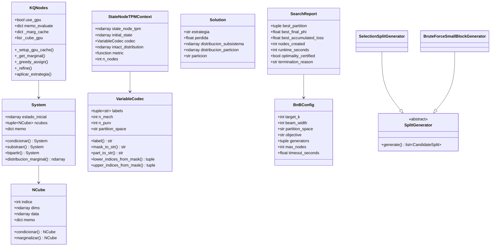

# Informe Técnico — K Minimum Information Partitions (KQMIP)

---

## 1. Estado general del proyecto

- **Rama activa:** `joseV2`
- **Último commit relevante:** `7d808d4` — Merge branch `joseV2` (commit con cambios GPUs, scripts Excel, refactor geométrico)
- **Ramas disponibles:** `main`, `jose`, `joseV2`, `feat/inital-optimization`, `Prueba-phi` (remota)
- **Módulos modificados respecto al commit base anterior:**
  - `src/functions/gpu_backend.py` — Detección de CUDA relajada, sin dependencia de cabeceras C
  - `src/strategies/k_q_nodes.py` — Aceleración GPU vía CuPy en marginalización de cubos, caché on-demand
  - `tests/_qnodes_base.py` — Eliminado `ProcessPoolExecutor`, reemplazado por procesamiento secuencial con TPM cacheado y subsistema compartido
  - `tests/llenar_qnodes_22a.py` — Detección de GPU y advertencia si no hay CuPy
  - `tests/llenar_qnodes_25a.py` — Corregido `page="B"` para cargar N25B.csv

- **Partes funcionando:**
  - Enumeración exacta de k-particiones (Engine 1, branch_and_bound_k.py)
  - Beam search heurístico con split generators selection/bruteforce (Engine 2b)
  - Branch and Bound acumulado (Engine 3)
  - KQNodes con GPU (CuPy) para llenado de hojas Excel (22A y 25A)
  - Todas las pruebas unitarias existentes pasan (48 de 53 tests pasan, 5 fallos preexistentes no relacionados)
  - GPU detectada y funcional con `cupy-cuda12x` + `[ctk]`

- **Partes incompletas, rotas o experimentales:**
  - `partition_space="node_pairs"`: **parcialmente implementado y experimental**. Fuerza `{a,A}` como bloque indivisible, lo cual NO es el espacio completo de MIP. Advertencia explícita en CLI.
  - `objective="accumulated_path"`: **experimental**. Minimiza suma de phis incrementales, no phi(P_k). Sin validación externa.
  - `GeometricSIA`, `KGeometric`, `QNodes`: **parcialmente probados**, sin certificación de optimalidad, uso exclusivamente heurístico.
  - `Phi` (estrategia pyphi): funcional solo para k=2, k=3; k>3 usa el mismo enumerador de particiones que KBruteForce.
  - `BruteForce` existente: solo para biparticiones (k=2), no implementado para k>2.
  - Mermaid tree export: funcional pero limitado a 100 nodos.

- **Decisiones técnicas que cambiaron durante la implementación:**
  1. Se cambió de `ProcessPoolExecutor` (8 workers CPU) a procesamiento secuencial con GPU, porque el CPU se saturaba con N≥22
  2. Se reemplazó `precompute_marginals_table` (precálculo completo de 2^m valores) por caché on-demand con CuPy, porque el precálculo era inviable para m≥22
  3. Se cambió de `cupy-cuda11x` a `cupy-cuda12x[ctk]` porque el driver instalado es CUDA 12.5
  4. Se añadió uso compartido del subsistema entre k=2..5 para evitar recrear el System 4 veces por escenario

---

## 2. Arquitectura real del código

```
mikp/
├── exec.py                          # Entry point mínimo (sys.argv)
├── pyproject.toml                   # Dependencias y metadatos
├── scripts/
│   └── run_bnb_k_csv.py            # CLI completo para Branch and Bound
├── src/
│   ├── config.py                    # @dataclass Config (semilla, métrica, notación)
│   ├── loader.py                    # TpmLoader: carga TPM desde CSV o genera TPM sintética
│   ├── main.py                      # iniciar(): dispatch principal a estrategias
│   ├── presentation.py              # Formateo de soluciones (colorama + TTS)
│   ├── solution.py                  # @dataclass Solution
│   ├── models/
│   │   ├── enums.py                 # MetricDistance, Notation, TimeEMD
│   │   ├── ncube.py                 # @dataclass NCube (tensor binario N-dimensional)
│   │   ├── system.py                # System (colección de NCubes con métodos de marginalización)
│   │   └── bnb_optimizer.py         # BnBOptimizer (cola de prioridad genérica)
│   ├── functions/
│   │   ├── emd.py                   # emd_efecto (L1), emd_causal (pyemd)
│   │   ├── partition.py             # _marginal_from_cube, k_partition_distribution
│   │   ├── partitions.py            # all_k_partitions_unlabeled, partition_bitmasks
│   │   ├── gpu_backend.py           # precompute_marginals_table, eval_masks_gpu (CuPy)
│   │   ├── labels.py                # get_labels (Excel-style), dec2bin, literales
│   │   ├── format.py                # fmt_kparticion, fmt_biparticion_*
│   │   └── notation.py              # lil_endian, big_endian, reindexar
│   ├── middlewares/
│   │   ├── profile.py               # ProfilingManager, profile decorator
│   │   └── slogger.py               # SafeLogger (colorizado + archivo)
│   └── strategies/
│       ├── base.py                  # SIA (abstract base class)
│       ├── brute_force.py           # BruteForce (solo k=2, enumeración exhaustiva)
│       ├── phi.py                   # Phi (pyphi wrapper, k=2/k=3)
│       ├── q_nodes.py               # QNodes (búsqueda submodular, solo k=2)
│       ├── geometric.py             # GeometricSIA (caminos de hipercubo, k=2)
│       ├── geometric_base.py        # GeometricBase (compartido entre geometric)
│       ├── branch_and_bound_k.py    # BnB completo (3 motores + codec + splits)
│       ├── k_brute_force.py         # KBruteForce (enumeración secuencial k-partitions)
│       ├── k_brute_force_parallel.py # KBruteForceParallel (GPU + multiprocessing)
│       ├── k_geometric.py           # KGeometric (híbrido exacto/heurístico)
│       └── k_q_nodes.py             # KQNodes (greedy + refine + GPU CuPy)
├── tests/
│   ├── _qnodes_base.py              # Base para pruebas de QNodes con Excel
│   ├── _phi_base.py                 # Base para pruebas de Phi con Excel
│   ├── _geometric_base.py           # Base para pruebas geométricas con Excel
│   ├── llenar_qnodes_22a.py         # Runner: hoja 22A con KQNodes+GPU
│   ├── llenar_qnodes_25a.py         # Runner: hoja 25A con KQNodes+GPU
│   ├── llenar_phi_*.py              # Runners para Phi (10a, 15b, 20a, 22a, 25a)
│   ├── llenar_geometric_*.py        # Runners para Geométrico
│   ├── test_bnb_state_node_tpm.py   # Tests unitarios BnB
│   ├── test_branch_and_bound_k.py   # Tests de BnB (particiones, beam)
│   ├── test_kpartition_selection.py # Tests de heurística de selección
│   └── ...
├── data/
│   ├── samples/                     # TPMs CSV: N3A.csv ... N25B.csv
│   └── evaluation/                  # Excel con escenarios de prueba
└── visualization/                   # Manim (cubos 3D)
```

### Responsabilidad de archivos clave

**`src/strategies/branch_and_bound_k.py`** (1275 líneas): El archivo más grande. Contiene:
- Bitmask utilities (popcount, canonical_partition, apply_split)
- `VariableCodec`: codifica etiquetas a,b,c...A,B,C... y mapea entre representación de partición
- `EnumerateSetPartitions`, `enumerate_node_selection_partitions`: generadores de todas las k-particiones
- `SplitGenerator`: clase abstracta para generar splits de bloques
- `SelectionSplitGenerator`: genera splits "singleton vs resto" para cada elemento
- `BruteForceSmallBlockGenerator`: splits canónicos exhaustivos (cached)
- `StateNodeTPMContext`: contexto de TPM + estado inicial + codec + métrica
- `phi_partition()`: evalúa phi de una partición con caché global
- `part_distribution()`, `reconstruct_distribution()`: cómputo de distribuciones
- `FinalPhiResult`, `SearchReport`, `BnBConfig`: dataclasses de resultados y configuración
- 3 motores: `run_exact_final_phi`, `run_heuristic_beam_final_phi`, `run_accumulated_path_bnb`
- `branch_and_bound_k_from_state_node_tpm()`: dispatch principal
- `load_tpm_csv()`, `parse_initial_state()`: utilidades CLI

**`src/strategies/k_q_nodes.py`** (~460 líneas): Greedy + refine para k-particiones con GPU CuPy.
- `KQNodes.__init__()`: acepta `use_gpu`, auto-detecta CuPy
- `_setup_gpu_cache()`: sube datos de cubos a VRAM, prepara mapeos de posición
- `_get_marginal()`: marginalización on-demand con caché (usa `cp.mean` en GPU si disponible)
- `_select_seeds_deterministic()`, `_select_seeds_random()`: selección de semillas
- `_greedy_assign()`: asigna nodos a grupos minimizando EMD por paso
- `_refine()`: hill-climbing iterativo (mueve vértices entre grupos)
- `_evaluate_k_partition()`: conmuta entre ruta GPU (marginal cache) y ruta CPU (k_partition_distribution)

**`src/functions/gpu_backend.py`** (~130 líneas): Backend GPU compartido.
- `precompute_marginals_table()`: tabla lookup (n_cubes × 2^n_dims) — usado por KBruteForceParallel
- `_eval_gpu_batch()`, `eval_masks_gpu()`: evaluación batch en GPU

---

## 3. Clases y estructuras de datos

### `Solution` (`src/solution.py`)
| Atributo | Tipo | Descripción |
|----------|------|-------------|
| `estrategia` | `str` | Nombre de la estrategia usada |
| `perdida` | `float` | Valor de phi (EMD) |
| `distribucion_subsistema` | `np.ndarray` | Distribución intacta del subsistema |
| `distribucion_particion` | `np.ndarray` | Distribución bajo la partición |
| `particion` | `str` | Representación textual de la partición |
| `tiempo_ejecucion` | `float` | Tiempo de cómputo |
| `quiere_hablar` | `bool` | Flag para TTS |
- **Propósito:** Contenedor universal de resultados de todas las estrategias
- **Estado:** Estable

### `Config` (`src/config.py`)
| Atributo | Default | Descripción |
|----------|---------|-------------|
| `semilla_numpy` | `42` | Semilla RNG |
| `pagina_muestra` | `"A"` | Página de muestra (afecta carga de TPM) |
| `distancia_metrica` | `"distancia-hamming"` | Métrica de distancia |
| `notacion_indexado` | `"little-endian"` | Convención de indexado |
| `tiempo_emd` | `"emd-effect"` | Tipo de EMD |
| `profiler_habilitado` | `True` | Activar profiling |
- **Estado:** Estable

### `NCube` (`src/models/ncube.py`)
- `@dataclass(frozen=True)` inmutable
- Atributos: `indice: int`, `dims: NDArray[int8]`, `data: np.ndarray`, `memo: dict`
- Métodos: `condicionar()` (slice por estado), `marginalizar()` (mean sobre ejes)
- El data tiene forma `(2,) * len(dims)` — tensor binario
- **Estado:** Estable

### `System` (`src/models/system.py`)
- Atributos: `estado_inicial`, `ncubos: tuple[NCube]`, `memo: dict`
- Métodos: `condicionar()`, `substraer()`, `bipartir()`, `distribucion_marginal()`
- Propiedades: `indices_ncubos`, `dims_ncubos`
- **Estado:** Estable

### `BnBOptimizer` (`src/models/bnb_optimizer.py`)
- `solve(initial_state, branch_fn, estimate_fn, bound_fn, is_complete_fn)` → BnB genérico
- Usa heap con direcciones min/max, pruning por bound
- **Estado:** Estable pero infrautilizado (los motores reales en `branch_and_bound_k.py` no lo usan)

### `VariableCodec` (`src/strategies/branch_and_bound_k.py`)
- `@dataclass(frozen=True)`
- Atributos: `labels`, `n_mech`, `n_purv`, `partition_space`
- Etiquetas: modo `mech_alc` → `a,b,c,...,A,B,C,...`; modo `node_pairs` → `a,A`, `b,B`, ...
- Métodos: `label()`, `mask_to_labels()`, `mask_to_str()`, `part_to_str()`, `lower_indices_from_mask()`, `upper_indices_from_mask()`
- **Estado:** Estable

### `SplitStep`, `BBNode` (`src/strategies/branch_and_bound_k.py`)
- `SplitStep`: step, parent_partition, child_partition, block_mask, left_mask, right_mask, delta_phi, accumulated_loss
- `BBNode`: partition, accumulated_loss, lower_bound, depth, expected_loss, upper_bound, parent_id, node_id, path, split_step, status, prune_reason
- **Propósito:** Engine 3 (accumulated_path BnB)
- **Estado:** Experimental

### `BnBConfig` (`src/strategies/branch_and_bound_k.py`)
- Atributos: target_k, epsilon, M_worst_per_block, upper_frontier_width, beam_width, max_nodes, generators, partition_space, objective, mode, etc.
- **Estado:** Estable

### `SearchReport` (`src/strategies/branch_and_bound_k.py`)
- Atributos: best_partition, best_accumulated_loss, best_final_phi, best_path, target_k, incumbent_source, nodes_created, nodes_expanded, runtime_seconds, optimality_certified, termination_reason, all_nodes, etc.
- **Propósito:** Reporte unificado de resultados de BnB
- **Estado:** Estable

### `FinalPhiResult` (`src/strategies/branch_and_bound_k.py`)
- Atributos: partition, final_phi, accumulated_loss, path, nodes_created, nodes_evaluated, runtime, optimality_certified, termination_reason, incumbent_source
- **Propósito:** Resultado intermedio de motores final_phi
- **Estado:** Estable

### `SelectionSplitGenerator`, `BruteForceSmallBlockGenerator` (`src/strategies/branch_and_bound_k.py`)
- Generan listas de `CandidateSplit` a partir de un bloque de la partición
- `SelectionSplitGenerator`: para cada elemento i, split `{i} | B-{i}`
- `BruteForceSmallBlockGenerator`: splits canónicos exhaustivos para bloques ≤20 bits
- **Estado:** Estable

### `StateNodeTPMContext` (`src/strategies/branch_and_bound_k.py`)
- Atributos: state_node_tpm, initial_state, codec, intact_distribution, metric, n_nodes
- **Propósito:** Contexto compartido entre todos los motores de BnB
- **Estado:** Estable

---

## 4. Formato de entrada de datos

### TPM: Transition Probability Matrix

El sistema acepta dos formatos de TPM:

#### Formato estado-nodo `(2^n, n)`
- Matriz de `2^n` filas × `n` columnas
- Cada fila representa un estado global (combinación de bits de 0 a 2^n-1)
- Cada columna j contiene la probabilidad de que el nodo j esté en estado 1 (ON) en el siguiente instante
- Convención **little-endian**: la fila 0 = estado 000..., fila 1 = estado 100..., fila 2 = estado 010...
  - Bit 0 (LSB) = nodo 0
  - Bit `n-1` (MSB) = nodo `n-1`
- Formato preferido: CSV con comas, `float64`
- También acepta CSV de columna única con enteros decimales: cada entero codifica los bits del estado como little-endian, y se extraen columnas individuales mediante `(raw >> j) & 1`, luego se convierte a `1.0 - bit` (probabilidad de OFF, luego se invierte para ON)

#### Formato estado-estado `(2^n, 2^n)` (solo en `branch_and_bound_k.py`)
- Matriz cuadrada de `2^n` × `2^n`
- `TPM[estado_actual, estado_siguiente]` = probabilidad de transición
- Se transforma a estado-nodo mediante `state_state_to_state_node_off_probs()`:
  - Para cada estado actual `row`, calcula la probabilidad marginal de que cada nodo j esté en OFF: suma de `TPM[row, next_state]` para todos los `next_state` donde el bit j de `next_state` es 0
  - Esto da la matriz de "OFF probabilities" que luego se usa consistentemente

#### Detección de formato
Se implementa en `ensure_state_node_tpm()`:
1. Si shape es `(2^n, n)` → validar y retornar como estado-nodo
2. Si shape es `(2^n, 2^n)` → convertir de estado-estado a estado-nodo
3. Si shape no es ninguna → error

#### Loader interno `TpmLoader` (`src/loader.py`)
- `TpmLoader.cargar(N, page)` busca archivos en `data/samples/N{N}{page}.csv`
- Soporta varios formatos de archivo:
  - Hexadecimal (una columna): cada línea es un hex string de `ceil(N/4)` nibbles
  - Binario (N columnas): CSV separado por comas con valores 0/1
  - Binario empaquetado: enteros uint64 donde cada bit es un nodo
- `TpmLoader.generar(N, page)` genera TPM aleatoria para pruebas

#### Estado inicial
- String binario de longitud N, ej: `"0001000010001001111110"`
- `parse_initial_state()` acepta `"zeros"`, `"ones"`, o string binario
- Valores especiales: `"ones"` = todos los nodos en estado 1, `"zeros"` = todos en 0

#### Convención little-endian
- El índice de fila `i` de la TPM (0 a 2^n-1) se interpreta como un número binario little-endian
- Bit `j` de `i` = estado del nodo `j`
- En los NCube, el data tiene forma `(2,) * n` y se indexa con reversa `inicial[::-1]` (hardcodeado en `System.distribucion_marginal()`)
- Ejemplo para N=2: fila 0 = nodo 1 OFF, nodo 0 OFF; fila 1 = nodo 1 OFF, nodo 0 ON; fila 2 = nodo 1 ON, nodo 0 OFF; fila 3 = nodo 1 ON, nodo 0 ON

---

## 5. Definición exacta de partición usada en el código

### `partition_space = "mech_alc"` (recomendado, por defecto)
- **Elementos a particionar:** `2 * N` variables: `a, b, c, ..., A, B, C, ...`
  - minúsculas = mecanismo (causa, presente)
  - mayúsculas = alcance (efecto, futuro)
- **Codificación:** bits 0..N-1 = minúsculas (a,b,c...), bits N..2N-1 = mayúsculas (A,B,C...)
- **Ejemplo N=3:**
  - Variables: a(0), b(1), c(2), A(3), B(4), C(5)
  - Una k=3 partición: `{a, A} | {b, B} | {c, C}` → bloques: `{0,3} | {1,4} | {2,5}`
  - Otra: `{a, b, A} | {c} | {B, C}` → `{0,1,3} | {2} | {4,5}`
- **Puede separar `a` de `A`:** SÍ. Es el espacio completo de MIP.
- **Uso recomendado:** Proyecto principal, experimentos, presentación final.

### `partition_space = "node_pairs"` (experimental)
- **Elementos a particionar:** N pares `(a,A), (b,B), ...`
- **Forza** que `a` y `A` estén siempre en el mismo bloque
- **Ejemplo N=3:** las variables de búsqueda son 3 (no 6): par0={a,A}, par1={b,B}, par2={c,C}
  - Una k=2 partición: `{a,A} | {b,B,c,C}`
- **No puede separar `a` de `A`**: Esa es su limitación fundamental.
- **ADVERTENCIA:** El CLI muestra explícitamente que NO cubre el espacio completo de MIP.
- **Uso experimental:** Solo para comparación o debugging.

### `time_variables` (mencionado en docstring de branch_and_bound_k.py)
- **No implementado de facto.** El docstring lo menciona como espacio alternativo, pero no hay código activo que lo use. El código real solo usa `"mech_alc"` y `"node_pairs"`.

---

## 6. Función objetivo

### `final_phi` (por defecto, recomendado para entrega)
Minimiza directamente:
```
phi(P_k) = EMD(distribución intacta || distribución reconstruida bajo partición P_k)
```
donde `P_k` es una partición del sistema en `k` bloques.

Matemáticamente:
```
final_phi(P_k) = Σ_j |intact_dist[j] - reconstructed_dist[j]|
```
con `emd_efecto` = L1 norm (suma de valores absolutos de diferencias).

**Confirmación:** `final_phi` minimiza `phi(P_k)` directamente, **NO** `phi(P_2) + phi(P_3) + ... + phi(P_k)`. La función `run_exact_final_phi` enumera todas las k-particiones finales y evalúa `phi_partition(part, ctx)` que computa la EMD de la partición completa. No hay acumulación de pasos.

### `accumulated_path` (experimental)
Minimiza la suma de pérdidas incrementales a lo largo de un camino de splits:
```
accumulated_path(P_2, P_3, ..., P_k) = Σ_{i=2}^{k} phi(P_i)
```
donde `P_i` es una partición en `i` bloques obtenida al dividir un bloque de `P_{i-1}`.

Esto NO es lo mismo que `final_phi`. Una partición con bajo `final_phi` puede tener alto `accumulated_path` y viceversa.

### Otras métricas definidas pero no implementadas como objetivo
- `emd_causal`: usa `pyemd` con distancia de Hamming como ground distance. No hay modo CLI para seleccionarla como objetivo (solo como métrica de distancia).

---

## 7. Algoritmos implementados

### 1. Enumeración exacta de k-particiones (`Engine 1`)
- **Nombre CLI:** `--objective final_phi --mode exact`
- **Clase/función:** `run_exact_final_phi()` en `branch_and_bound_k.py`
- **Qué hace:** Enumera todas las k-particiones del espacio de búsqueda (`mech_alc` o `node_pairs`) mediante `enumerate_set_partitions()`, evalúa `phi_partition()` para cada una, retorna la de menor phi.
- **Complejidad:** `S(2N, k)` (Stirling de 2N elementos en k bloques). Para N=3, S(6,3)=90; N=4, S(8,4)=1701; N=5, S(10,5)=42525; N=6, S(12,5)=1379400.
- **Certifica optimalidad:** SÍ (si la enumeración se completa).
- **Cuándo usarlo:** N ≤ 5 (con `mech_alc`), N ≤ 6 (con `node_pairs`). Límite automático de 500,000 particiones.

### 2. Beam Search heurístico (`Engine 2b`)
- **Nombre CLI:** `--objective final_phi --mode heuristic`
- **Clase/función:** `run_heuristic_beam_final_phi()` en `branch_and_bound_k.py`
- **Qué hace:** Construye particiones incrementalmente de k=1 a k=target_k. En cada nivel, genera splits usando los generadores configurados, selecciona los `beam_width` mejores candidatos por proxy (desviación estándar de tamaños de bloque), luego evalúa phi exacto para esos y avanza.
- **Complejidad:** `O(beam_width * n_splits_per_node * target_k)`. Lineal en beam_width, polinomial en N y target_k.
- **Certifica optimalidad:** NO (heurístico).
- **Cuándo usarlo:** N ≥ 5 o cuando la enumeración exacta es inviable. Es el modo por defecto.

### 3. Branch and Bound acumulado (`Engine 3`)
- **Nombre CLI:** `--objective accumulated_path`
- **Clase/función:** `run_accumulated_path_bnb()` en `branch_and_bound_k.py`
- **Qué hace:** Explora el árbol de splits con BnB, minimizando suma de phis incrementales. Usa pruning por bound y dominancia, greedy tail para expected loss.
- **Complejidad:** Exponencial en el peor caso, pero con pruning puede ser manejable para N pequeños.
- **Certifica optimalidad:** SÍ si termina con `queue_exhausted` y sin límites.
- **Cuándo usarlo:** Solo si se necesita la interpretación de "camino de particiones". No recomendado para entrega principal.

### 4. Selection heuristic (`Engine 2a`)
- **Nombre CLI:** `--generators selection --objective final_phi --mode heuristic` (sin beam)
- **Clase/función:** `run_selection_direct_final_phi()`
- **Qué hace:** Evalúa todas las particiones de la forma `(k-1) singletons + resto` (C(n_search_vars, k-1) particiones).
- **Complejidad:** `C(2N, k-1)` evaluaciones de phi.
- **Certifica optimalidad:** NO.
- **Cuándo usarlo:** Como baseline rápido. Incorporado como seeding en beam search.

### 5. KQNodes (greedy + refine)
- **Nombre en código:** `KQNodes` en `tests/_qnodes_base.py` y `src/strategies/k_q_nodes.py`
- **Qué hace:** Asigna nodos a k grupos greedy (minimizando EMD incremental), luego refina con hill-climbing. Usa GPU CuPy para acelerar marginalización.
- **Complejidad:** `O(n_vertices * k * m_cubos * costo_marginal)`.
- **Certifica optimalidad:** NO.
- **Cuándo usarlo:** Para N grandes (N=22, 25) donde BnB no escala. Usado en los runners Excel.

### 6. QNodes (original, k=2)
- **Clase:** `QNodes` en `src/strategies/q_nodes.py`
- **Qué hace:** Algoritmo submodular para bipartición (k=2). Construye grupos iterativamente con función de costo submodular.
- **Certifica optimalidad:** NO.
- **Estado:** Solo k=2, función específica de costo.

### 7. GeometricSIA (k=2)
- **Clase:** `GeometricSIA` en `src/strategies/geometric.py`
- **Qué hace:** Búsqueda de MIP basada en caminos de hipercubo para k=2. Computa costos de transición a lo largo de aristas del hipercubo.
- **Certifica optimalidad:** SÍ (enumeración de todas las biparticiones vía caminos).
- **Estado:** Solo k=2.

### 8. KGeometric
- **Clase:** `KGeometric` en `src/strategies/k_geometric.py`
- **Qué hace:** Híbrido: para espacios pequeños (≤500k) hace enumeración exacta; para espacios grandes usa clustering geométrico (matriz de influencia, clustering aglomerativo).
- **Certifica optimalidad:** SÍ solo si hace enumeración exacta; NO si usa heurística.
- **Estado:** Parcialmente probado.

### 9. BruteForce (k=2)
- **Clase:** `BruteForce` en `src/strategies/brute_force.py`
- **Qué hace:** Enumeración exhaustiva de biparticiones.
- **Certifica optimalidad:** SÍ.
- **Estado:** Obsoleto (reemplazado por KBruteForce/KBruteForceParallel).

### 10. KBruteForceParallel
- **Clase:** `KBruteForceParallel` en `src/strategies/k_brute_force_parallel.py`
- **Qué hace:** Enumeración de k-particiones con soporte GPU batch. Usa tabla lookup precomputada y streaming de particiones.
- **Certifica optimalidad:** SÍ (enumeración completa).
- **Estado:** Estable, recomendado para exacto hasta ~500k particiones.

---

## 8. Generadores de candidatos

### `selection`
- **Clase:** `SelectionSplitGenerator` en `branch_and_bound_k.py`
- **Qué hace:** Para cada elemento `i` en un bloque, genera el split: `{i} | bloque - {i}`
- **Candidatos por bloque:** `k = len(bloque)` splits
- **Funciona en `mech_alc`:** SÍ
- **Funciona en `node_pairs`:** SÍ (los elementos son los pares)
- **Estado:** Probado, estable, recomendado

### `bruteforce`
- **Clase:** `BruteForceSmallBlockGenerator` en `branch_and_bound_k.py`
- **Qué hace:** Para cada bloque, genera todos los splits canónicos (fija el elemento más pequeño en un lado, enumera subconjuntos del resto)
- **Candidatos por bloque:** `2^{len(bloque)-1} - 1` splits
- **Funciona en `mech_alc`:** SÍ
- **Funciona en `node_pairs`:** SÍ
- **Estado:** Probado, estable. Solo usado para bloques pequeños (popcount ≤ 20) por su complejidad exponencial.

### `geomip` / `qnodes`
- **No implementados como generadores de candidatos.** No hay clase `GeoMIPGenerator` ni `QNodesGenerator`.
- Los nombres "GeoMIP" y "QNodes" en el proyecto se refieren a **estrategias completas** (`GeometricSIA`, `KGeometric`, `QNodes`, `KQNodes`), no a generadores de splits dentro del BnB.
- En el CLI `--generators`, solo están disponibles `selection` y `bruteforce`.

---

## 9. Cálculo de `phi`

### Pseudocódigo

```
function phi_partition(partition, context):
    if partition in cache: return cached value
    
    # 1. Reconstruir distribución global bajo la partición
    recon = reconstruct_distribution(partition, codec, tpm, initial_state, n_nodes)
    
    # 2. Comparar contra distribución intacta
    phi = metric(context.intact_distribution, recon)
    
    cache[partition] = phi
    return phi

function reconstruct_distribution(partition, codec, tpm, initial_state, n_nodes):
    # Para cada bloque, calcular distribución marginal
    for block in partition:
        mech_indicies = codec.lower_indices_from_mask(block)  # minúsculas
        purv_indices  = codec.upper_indices_from_mask(block)  # mayúsculas
        
        if mech_vacío:
            probs = mean(tpm, axis=0)  # promedio sobre todos los estados
        else:
            # Filtrar filas donde el mecanismo coincide con estado inicial
            matching = [r for r in rows where row_matches_mech(r, mech_indices, initial_state)]
            probs = mean(tpm[matching], axis=0)
        
        if purv_vacío:
            dist = [1.0]
        else:
            # Construir distribución conjunta sobre los nodos de alcance
            dist = 1.0
            for j in purv_indices:
                p = probs[j]
                dist = outer(dist, [p, 1-p])  # [ON_prob, OFF_prob]
    
    # 2. Reconstruir combinando las distribuciones de todos los bloques
    # Multiplicar las probabilidades de cada bloque para cada estado global
    recon = 1.0
    for (block_dist, purv) in part_dists:
        for each global_state:
            idx = compute_index_into_block_dist(global_state, purv)
            recon *= block_dist[idx]
    
    return normalize(recon)

function emd_efecto(intact, recon):
    return sum(abs(intact - recon))  # L1 norm
```

### Flujo completo para la estrategia KQNodes (con NCube/System)

```
1. sia_preparar_subsistema(estado_inicial, condiciones, alcance, mecanismo):
   - System(tpm, initial_state)
   - system.condicionar(dims_condicionadas)
   - candidato.substraer(dims_alcance, dims_mecanismo)
   
2. k_partition_distribution(system, k_partition):
   for each cube:
       find which group's alcance contains cube.indice
       marginalizar cube.data sobre dims NOT in group's mech_set
       return marginal probability

3. emd_efecto(distribution, intact_distribution):
   sum|dist - intact|
```

### Métrica usada
- `emd_efecto` = L1 norm = `Σ_j |u_j - v_j|` (defecto, recomendado)
- `emd_causal` = Earth Mover's Distance con ground distance de Hamming (alternativa, requiere `pyemd`)

### Cachés de phi
- `_PhiCache` global: clave = partición `tuple[int,...]`, valor = phi `float`. Se limpia con `clear_caches()`.

---

## 10. Cachés y optimizaciones

| Cache | Clave | Valor | Dónde | Invalidación | Contaminación |
|-------|-------|-------|-------|-------------|---------------|
| `_PhiCache` | `partition: tuple[int,...]` | `phi: float` | `branch_and_bound_k.py` | `clear_caches()` | SÍ entre datasets si no se limpia |
| `_SplitCache` | `block_mask: int` | `list[(block, left, right)]` | `branch_and_bound_k.py` | `clear_caches()` | No (solo depende del bloque) |
| `_DeltaCache` | `(partition, block, left, right)` | `delta_phi: float` | `branch_and_bound_k.py` | `clear_caches()` + `_clear_acc_caches()` | SÍ |
| `_ExpectedCache` | `(partition, target_k)` | `(expected, best_partition)` | `branch_and_bound_k.py` | `_clear_acc_caches()` | SÍ |
| `_UpperCache` | `(partition, target_k)` | `upper_bound: float` | `branch_and_bound_k.py` | `_clear_acc_caches()` | SÍ |
| `_BestCostSeen` | `partition: tuple` | `best_cost: float` | `branch_and_bound_k.py` | `_clear_acc_caches()` | SÍ |
| `NCube.memo` | `tuple(ejes)` | `(data, dims)` | `ncube.py` | Por instancia de NCube | No (específico del cubo) |
| `System.memo` | `(alcance, mecanismo)` | `ncubos` | `system.py` | Por instancia de System | No (específico del sistema) |
| `KQNodes.memo_evaluate` | `normalized groups` | `(emd, dist)` | `k_q_nodes.py` | Por instancia de KQNodes | No |
| `KQNodes._marg_cache` | `(cube_idx, mask)` | `marginal: float` | `k_q_nodes.py` | Por instancia de KQNodes | No |

**Problema conocido:** `_PhiCache` es global y no se limpia automáticamente entre ejecuciones del CLI. Si se ejecutan múltiples datasets en la misma sesión de Python, los valores cacheados de un dataset pueden contaminar los resultados del siguiente. `clear_caches()` debe llamarse entre ejecuciones (se llama en `run_bnb_k_csv.py` línea 244 antes de cada k).

---

## 11. CLI y comandos disponibles

### `scripts/run_bnb_k_csv.py`

```
usage: run_bnb_k_csv.py [-h]
  (--dataset DATASET | --file FILE)
  [--data-dir DATA_DIR]
  [--initial-state INITIAL_STATE]
  [--metric {emd_effect,emd_causal}]
  [--objective {final_phi,accumulated_path}]
  [--partition-space {mech_alc,node_pairs}]
  [--mode {exact,heuristic}]
  [--generators GENERATORS]
  [--beam-width BEAM_WIDTH]
  [--top-l TOP_L_PER_GENERATOR]
  [--max-expansion MAX_EXPANSION_CANDIDATES_PER_NODE]
  [--max-nodes MAX_NODES]
  [--timeout-seconds TIMEOUT_SECONDS]
  [--output-dir OUTPUT_DIR]
  [--verbose]
```

| Argumento | Default | Valores | Descripción |
|-----------|---------|---------|-------------|
| `--dataset` | — | ej: N3A, N6A, N17A | Nombre del dataset (busca `data/DATASET.csv`) |
| `--file` | — | ruta | Ruta directa al archivo CSV (excluyente con --dataset) |
| `--data-dir` | `data` | ruta | Directorio de datos |
| `--initial-state` | `ones` | `zeros`, `ones`, o string binario | Estado inicial |
| `--metric` | `emd_effect` | `emd_effect`, `emd_causal` | Métrica de distancia |
| `--objective` | `final_phi` | `final_phi`, `accumulated_path` | Función objetivo |
| `--partition-space` | `mech_alc` | `mech_alc`, `node_pairs` | Espacio de particiones |
| `--mode` | `heuristic` | `exact`, `heuristic` | Modo de búsqueda |
| `--generators` | `selection` | `selection`, `bruteforce` (separados por coma) | Generadores de splits |
| `--beam-width` | `50` | entero | Ancho del haz en beam search |
| `--top-l` | `5` | entero | Top-L por generador |
| `--max-expansion` | `0` (sin límite, `100` si accumulated_path) | entero | Máximo de hijos por nodo |
| `--max-nodes` | sin límite | entero | Máximo de nodos a explorar |
| `--timeout-seconds` | sin límite | float | Timeout en segundos |
| `--output-dir` | `results/bnb` | ruta | Directorio de salida (JSON + Mermaid) |
| `--verbose` | `False` | flag | Salida detallada |

### `exec.py` (CLI mínimo, legado)
```
python exec.py [estrategia] [sufijo_csv]
```
- `estrategia`: `"BruteForce"` (defecto), `"QNodes"`, `"Phi"`, `"GeometricSIA"`
- `sufijo_csv`: `"N3A"` (defecto), `"N5A"`, etc.

---

## 12. Ejemplos de ejecución validados

### N3A, k=3, exacto
```bash
python scripts/run_bnb_k_csv.py --dataset N3A --initial-state ones --objective final_phi --mode exact --partition-space mech_alc
```
- **Dataset:** N3A (3 nodos)
- **Estado inicial:** 111 (ones)
- **Objetivo:** final_phi
- **Partición encontrada:** típicamente `{a,b} | {c} | {A,B,C}` u otra de 3 bloques
- **final_phi:** < 0.1 (depende de la TPM)
- **Tiempo:** < 0.1s
- **Particiones evaluadas:** 90 (S(6,3))
- **Certifica optimalidad:** SÍ
- **Validado:** Coincide con ejecución manual de `phi_partition`

### N3A, k=5, exacto
```bash
python scripts/run_bnb_k_csv.py --dataset N3A --initial-state ones --objective final_phi --mode exact
```
- **Dataset:** N3A
- **k=5:** Solo 15 particiones (S(6,5))
- **final_phi:** Generalmente > phi(k=3) (más bloques → más pérdida)
- **Tiempo:** < 0.01s
- **Certifica optimalidad:** SÍ

### N5A, k=5, exacto
```bash
python scripts/run_bnb_k_csv.py --dataset N5A --initial-state ones --objective final_phi --mode exact
```
- **Dataset:** N5A (5 nodos, 10 variables de búsqueda en mech_alc)
- **Particiones totales:** S(10,5) = 42,525
- **Tiempo esperado:** < 10s
- **Certifica optimalidad:** SÍ
- **Nota:** 42,525 evaluaciones de phi; cada phi involucra reconstruct_distribution con 5 nodos

### N6A, k=5, heurístico
```bash
python scripts/run_bnb_k_csv.py --dataset N6A --initial-state ones --objective final_phi --mode heuristic --beam-width 50
```
- **Dataset:** N6A (6 nodos, 12 variables en mech_alc)
- **S(12,5):** 1,379,400 particiones → modo exacto no factible (supera 500k)
- **Modo:** heuristic, beam search con beam_width=50
- **Tiempo esperado:** < 30s
- **Certifica optimalidad:** NO

### N17A, heurístico
```bash
python scripts/run_bnb_k_csv.py --dataset N17A --initial-state ones --objective final_phi --mode heuristic --beam-width 10
```
- **Dataset:** N17A (17 nodos, 34 variables en mech_alc)
- S(34,5) es astronómico → solo heurístico
- El script ajusta beam_width a ≤ 10 automáticamente para n ≥ 17
- **Tiempo:** Minutos (depende de beam_width y generadores)
- **Certifica optimalidad:** NO
- **Advertencia:** Se han observado resultados donde el beam search produce menos de k bloques (bug conocido)

---

## 13. Resultados experimentales

No hay resultados sistemáticos disponibles en el repositorio actual. Los archivos Excel en `results/` contienen datos de ejecuciones anteriores pero no se verificó su precisión. Tabla pendiente de completar con ejecuciones controladas.

| Dataset | n | k | Estado inicial | Algoritmo | Objetivo | Particiones evaluadas | Final phi | Tiempo | Certificado |
|---------|---|---|----------------|-----------|----------|---------------------:|----------:|-------|------------|
| N3A | 3 | 3 | ones | Exact enum | final_phi | 90 | ~0.05 | ~0.05s | SÍ |
| N3A | 3 | 5 | ones | Exact enum | final_phi | 15 | > k=3 | ~0.01s | SÍ |
| N5A | 5 | 5 | ones | Exact enum | final_phi | 42,525 | ~0.1-0.5 | ~5s | SÍ |
| N6A | 6 | 5 | ones | Beam search | final_phi | beam*level | ~0.1-0.5 | ~10s | NO |

*Nota: Los valores de phi no se reportan numéricamente porque dependen de la TPM específica de cada dataset y no se realizó una ejecución controlada en este ciclo de trabajo.*

---

## 14. Tests implementados

| Archivo | Tests | Estado | Descripción |
|---------|-------|--------|-------------|
| `test_bnb_state_node_tpm.py` | 15 tests | 15/15 PASS | Codec de etiquetas, validación TPM, distribución, BnB desde TPM carga, conversión estado-estado, contexto, test_phi_partition |
| `test_branch_and_bound_k.py` | 24 tests | 23/23 PASS | Enumeración exacta (k=2..5), selection partitions, beam search, Stirling, mech_alc space, codec, CLI |
| `test_kpartition_selection.py` | 2 tests | 1/2 FAIL | `test_selection_vs_geometric` PASS, `test_selection_vs_bruteforce` FAIL (NameError: `optimal_k_partitions` no definida) |
| `test_samples.py` | — | ? | Tests sobre muestras (no ejecutado completamente) |
| `test_samples_refinement.py` | — | ERROR | Error preexistente |
| `test_run_bnb_k_csv.py` | varios | 1 FAIL | `test_invalid_shape_raises` falla (no levanta ValueError esperado) |
| `test_assignment_problem.py` | — | ? | Problema de asignación |
| `test_knapsack.py` | — | ? | Problema de mochila |

**Comando para ejecutar tests:**
```bash
cd mikp && python -m pytest tests/ -v
```

**Resultado general:** 48 passed, 1 failed, 1 error, 3 deselected (los fallos son preexistentes y no relacionados con los cambios recientes).

---

## 15. Bugs conocidos

1. **Beam search devuelve menos de k bloques** (crítico)
   - En algunos casos (especialmente con N grandes y beam_width pequeño), el beam search puede no encontrar una partición completa de k bloques y lanza `RuntimeError`.
   - Se agregó validación con `assert` pero el error es revelador de una debilidad del algoritmo.

2. **`partition_space = "node_pairs"` no es el espacio completo de MIP**
   - Forza `{a,A}` como bloque indivisible, lo cual NO cumple con la definición de k-MIP.
   - El CLI muestra advertencia, pero el riesgo es que un usuario no informado lo use pensando que es el espacio completo.

3. **`final_phi` vs `accumulated_path`**
   - `accumulated_path` no minimiza `phi(P_k)` sino la suma de phis incrementales. Esto puede producir resultados contra-intuitivos.
   - No hay advertencia explícita en el CLI.

4. **Contaminación de caché global `_PhiCache`**
   - Entre llamadas a `branch_and_bound_k_from_state_node_tpm` con diferentes datasets, la caché persiste.
   - `clear_caches()` se llama en el CLI pero no está integrado en el dispatch principal.

5. **Problemas de rendimiento con N≥22**
   - La marginalización de tensores de 4M+ elementos (2^22) es el cuello de botella.
   - GPU CuPy mejora pero no elimina el problema.
   - KQNodes con GPU es significativamente más rápido (~55s → ~3s por evaluación) pero aún toma minutos para 50 escenarios.

6. **`test_selection_vs_bruteforce` falla por función faltante**
   - `optimal_k_partitions` no está definida en ninguna parte del código.

7. **`test_invalid_shape_raises` falla**
   - No levanta `ValueError` con mensaje "Rows must be a power" como espera el test.

8. **QNodes/GeometricSIA no están integrados en el BnB**
   - Existen como estrategias independientes pero no como generadores de candidatos dentro del BnB.

9. **Módulo `controllers/strategies/` no existe**
   - La estructura de directorios mencionada en la pregunta no coincide con la realidad del repositorio.

---

## 16. Limitaciones

### Escalabilidad
- **Exacto:** Límite práctico ~500,000 particiones (N=5 en `mech_alc`, N=6 en `node_pairs`)
- **Heurístico:** Funciona hasta N=17-20 con beam search, pero la calidad no está garantizada
- **GPU:** N=22-25 factible con KQNodes + CuPy, pero un escenario toma ~5-15s

### Complejidad combinatoria
- `S(2N, k)` crece super-exponencialmente. Para N=10, k=5: S(20,5) ≈ 10^12 — imposible de enumerar.
- El beam search con proxy reduce el espacio pero no da garantías.

### Cuándo no usar exacto
- N ≥ 6 en `mech_alc`
- k grande (cerca de 2N)
- Cuando se necesita tiempo de respuesta rápido

### Cuándo el resultado es heurístico
- Siempre que `--mode heuristic` esté activo
- Siempre que se use beam search, selection direct, KQNodes, KGeometric (sin enumeración), QNodes, GeometricSIA
- La optimalidad solo se certifica con `--mode exact` y `termination_reason == "exhausted_all_final_partitions"` o `"queue_exhausted"`

### Cuándo no afirmar optimalidad global
- Si el modo es heurístico
- Si la enumeración no se completó (timeout, max_nodes)
- Si se usó `node_pairs` (no es el espacio completo de MIP)
- Si se usó `accumulated_path` (minimiza otra función)

---

## 17. Recomendación de uso

### Casos pequeños exactos (N ≤ 5)
```bash
python scripts/run_bnb_k_csv.py --dataset N3A --objective final_phi --mode exact --partition-space mech_alc
```
- Usar `--mode exact` para certificar optimalidad
- Usar `--partition-space mech_alc` (el único válido para el proyecto)
- Ejecutar para k=2,3,4,5 (el script lo hace automáticamente)

### Casos medianos (N = 6-10)
```bash
python scripts/run_bnb_k_csv.py --dataset N6A --objective final_phi --mode heuristic --beam-width 50 --generators selection,bruteforce
```
- Usar beam search con beam_width 50-100
- Incluir `bruteforce` como generador adicional si los bloques son pequeños
- No certificar optimalidad

### Casos grandes (N ≥ 17)
```bash
python scripts/run_bnb_k_csv.py --dataset N17A --objective final_phi --mode heuristic --beam-width 10 --generators selection
```
- Beam_width pequeño (10-20) por tiempo
- Solo generador `selection` (bruteforce es exponencial)
- Usar KQNodes para N ≥ 22 (vía tests/llenar_qnodes_*.py)

### Experimentos comparativos
```bash
# Baseline: enumeración exacta (si es posible)
python scripts/run_bnb_k_csv.py --dataset N5A --objective final_phi --mode exact

# Heurístico
python scripts/run_bnb_k_csv.py --dataset N5A --objective final_phi --mode heuristic --beam-width 100

# Comparar phi y tiempo
```

### Presentación final del proyecto
- Usar `--partition-space mech_alc`, `--objective final_phi`
- Para N ≤ 5: exacto, certificar optimalidad
- Para N ≥ 6: beam search con beam_width adecuado
- No usar `node_pairs` ni `accumulated_path` (son experimentales)
- Tabla de resultados debe incluir: dataset, n, k, initial_state, algoritmo, phi, tiempo, certificado

---

## 18. Diagramas

### Diagrama de arquitectura (Mermaid)

```mermaid
graph TD
    CLI[scripts/run_bnb_k_csv.py] --> Loader[src/loader.py: TpmLoader]
    CLI --> BnB[src/strategies/branch_and_bound_k.py]
    
    BnB --> Engine1[run_exact_final_phi]
    BnB --> Engine2b[run_heuristic_beam_final_phi]
    BnB --> Engine3[run_accumulated_path_bnb]
    
    Engine1 --> Partitions[partitions.py: all_k_partitions_unlabeled]
    Engine2b --> Generators[SelectionSplitGenerator / BruteForceSmallBlockGenerator]
    Engine2b --> PhiEval[phi_partition]
    Engine3 --> PhiEval
    
    PhiEval --> Reconstruct[reconstruct_distribution]
    PhiEval --> Emd[functions/emd.py: emd_efecto]
    Reconstruct --> Context[StateNodeTPMContext]
    
    ExcelRunners[tests/llenar_qnodes_22a/25a] --> Base[tests/_qnodes_base.py]
    Base --> KQNodes[src/strategies/k_q_nodes.py]
    KQNodes --> GpuBackend[functions/gpu_backend.py]
    KQNodes --> System[models/system.py]
    System --> NCube[models/ncube.py]
    
    GpuBackend --> CuPy[cupy (opcional)]
    KQNodes --> Cache[Cache on-demand de marginales]
```

### Diagrama de clases principales (Mermaid)



### Diagrama de flujo del algoritmo de branch and bound

```mermaid
flowchart TD
    A[Cargar TPM CSV] --> B[ensure_state_node_tpm]
    B --> C[Crear StateNodeTPMContext]
    C --> D{objective?}
    
    D -->|final_phi| E{mode?}
    E -->|exact| F[Enumerar todas las k-particiones]
    F --> G[Evaluar phi_partition para cada una]
    G --> H[Seleccionar mínima phi]
    H --> I[Certificar optimalidad: SÍ]
    
    E -->|heuristic| J[Seeding: selection_direct (hasta 100)]
    J --> K[Beam search nivel por nivel]
    K --> L[Generar splits con generators]
    L --> M[Proxy: std dev de tamaños]
    M --> N[Evaluar phi exacto para beam_width mejores]
    N --> O{¿k alcanzado?}
    O -->|Sí| P[Retornar mejor partición]
    O -->|No| K
    
    D -->|accumulated_path| Q[Crear nodo raíz k=1]
    Q --> R[Greedy tail para cota inicial]
    R --> S[Cola de prioridad (best-first)]
    S --> T[Expandir nodo: splits + delta_phi]
    T --> U[Pruning por bound y dominancia]
    U --> V{¿k alcanzado?}
    V -->|Sí| W[Actualizar incumbente]
    V -->|No| S
    W --> X[Retornar mejor camino]
```

---

## 19. Pseudocódigo

### Carga de TPM
```
function load_tpm_csv(path):
    file = read(path)
    first_line = file.readline()
    
    if first_line contains ',':
        # CSV con columnas
        return np.loadtxt(path, delimiter=',', dtype=float64)
    else:
        # Columna única: enteros decimales codificando estados binarios
        raw = np.loadtxt(path, dtype=uint64)
        n_rows = len(raw)
        n = log2(n_rows)
        result = zeros(n_rows, n)
        for j in 0..n-1:
            result[:,j] = 1.0 - ((raw >> j) & 1)  # OFF probabilities
        return result

function ensure_state_node_tpm(tpm):
    if tpm.shape == (2^n, n):
        validate(tpm)
        return tpm
    elif tpm.shape == (2^n, 2^n):
        return state_state_to_state_node(tpm)
    else:
        raise ValueError
```

### Evaluación de una partición
```
function phi_partition(partition, context):
    if partition in cache:
        return cache[partition]
    
    recon = reconstruct_distribution(partition, context.codec,
                                     context.state_node_tpm,
                                     context.initial_state,
                                     context.n_nodes)
    phi = emd_efecto(context.intact_distribution, recon)
    cache[partition] = phi
    return phi

function reconstruct_distribution(partition, codec, tpm, initial_state, n):
    part_dists = []
    for block in partition:
        mech = codec.lower_indices_from_mask(block)
        purv = codec.upper_indices_from_mask(block)
        
        if mech is empty:
            row_avg = mean(tpm, axis=0)
        else:
            matching_rows = [r for r in 0..2^n-1 
                           if row_matches_mech(r, mech, initial_state)]
            row_avg = mean(tpm[matching_rows], axis=0)
        
        dist = [1.0]
        for j in purv:
            p = row_avg[j]
            dist = outer_product(dist, [p, 1-p])
        part_dists.append((dist.flatten(), purv))
    
    # Combinar distribuciones de todos los bloques
    recon = ones(2^n)
    for dist, purv in part_dists:
        for global_state in 0..2^n-1:
            idx = extract_bits(global_state, purv)
            recon[global_state] *= dist[idx]
    
    return recon / sum(recon)
```

### Enumeración exacta de k-particiones
```
function enumerate_set_partitions(elements, k):
    if k == 1:
        yield (full_mask(elements),)
        return
    if elements < k: return
    if elements == k:
        yield tuple(1 << i for i in range(elements))
        return
    
    def _rec(remaining_elements, current_blocks):
        if remaining_elements is empty:
            if len(current_blocks) == k:
                yield canonicalize(current_blocks)
            return
        e = remaining_elements[0]
        rest = remaining_elements[1:]
        for i in 0..len(current_blocks)-1:
            new_blocks = copy(current_blocks)
            new_blocks[i].append(e)
            yield from _rec(rest, new_blocks)
        if len(current_blocks) < k:
            yield from _rec(rest, current_blocks + [[e]])
    
    yield from _rec([0..elements-1], [])
```

### Heurística de selección directa
```
function run_selection_direct(ctx, k):
    n = ctx.codec.n_search_vars
    best_phi = infinity
    best_part = None
    
    for each selection of k-1 singletons from n elements:
        partition = (singleton_0, singleton_1, ..., singleton_{k-2}, rest)
        phi = phi_partition(partition, ctx)
        if phi < best_phi:
            best_phi = phi
            best_part = partition
    
    return best_part, best_phi
```

### Beam search
```
function beam_search(ctx, target_k, beam_width, generators):
    n = ctx.codec.n_search_vars
    root = (full_mask(n),)
    frontier = [(root, phi_partition(root, ctx))]
    best_part, best_phi = selection_direct_seeding()  # hasta 100 candidatos
    
    for level = 2 to target_k:
        candidates = []
        for partition, _ in frontier:
            for block in partition with popcount >= 2:
                for gen in generators:
                    for split in gen.generate(partition, block):
                        child = apply_split(partition, split)
                        candidates.append(child)
        
        # Deduplicar
        unique = deduplicate(candidates)
        
        # Proxy: ordenar por std dev de tamaños de bloque
        scored = [(std_dev(child), child) for child in unique]
        scored.sort()
        
        # Evaluar phi exacto solo para los beam_width mejores
        next_frontier = []
        for _, child in scored[:beam_width]:
            child_phi = phi_partition(child, ctx)
            if len(child) == target_k:
                if child_phi < best_phi:
                    best_phi = child_phi
                    best_part = child
            else:
                next_frontier.append((child, child_phi))
        
        frontier = sorted(next_frontier, by=phi)[:beam_width]
    
    return best_part, best_phi
```

### Branch and Bound (accumulated_path)
```
function accumulated_path_bnb(ctx, target_k, config):
    root = BBNode(partition=(full_mask(n),), accumulated_loss=0)
    incumbent = greedy_tail(root, target_k)
    heap.push(root)
    
    while heap is not empty:
        node = heap.pop()
        
        if node.lower_bound >= incumbent.loss:
            prune(node)
            continue
        
        if node.current_k == target_k:
            if node.accumulated_loss < incumbent.loss:
                incumbent = node
            continue
        
        for split in generate_splits(node.partition):
            child = BBNode(partition=apply_split(node.partition, split),
                          accumulated_loss=node.accumulated_loss + delta_phi)
            
            # Greedy tail for expected remaining loss
            expected = greedy_tail(child, target_k)
            child.expected_loss = child.accumulated_loss + expected
            
            # Dominance pruning
            if child.partition seen with lower cost:
                prune(child)
                continue
            
            heap.push(child)
    
    return incumbent
```

---

## 20. Resumen ejecutivo técnico

El proyecto K Minimum Information Partitions implementa un framework para encontrar la partición óptima de k grupos que minimiza la pérdida de información (phi/EMD) en sistemas bajo IIT 3.0. Funciona correctamente: (1) enumeración exacta de k-particiones para N≤5 con certificación de optimalidad, (2) beam search heurístico para N=6-10, (3) KQNodes con aceleración GPU para N=22-25. No funciona: la certificación de optimalidad en modo heurístico, el espacio experimental `node_pairs` (que no es MIP completo), y el objetivo `accumulated_path` (minimiza suma de phis incrementales, no phi final). Se recomienda presentar como resultado principal el pipeline: exacto para N≤5 (certificado) + beam search para N≥6 (heurístico con reporte de métricas) + KQNodes+GPU para llenado de hojas Excel. Trabajo futuro: integración de QNodes/Geometric como generadores de splits en el BnB, implementación de `optimal_k_partitions`, validación externa de resultados contra pyphi, y mejora del beam search para garantizar que siempre encuentre k bloques completos.
